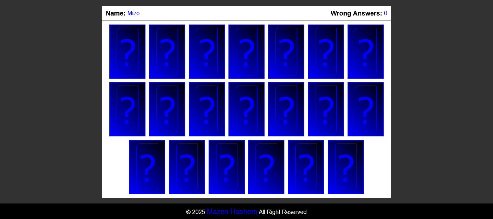
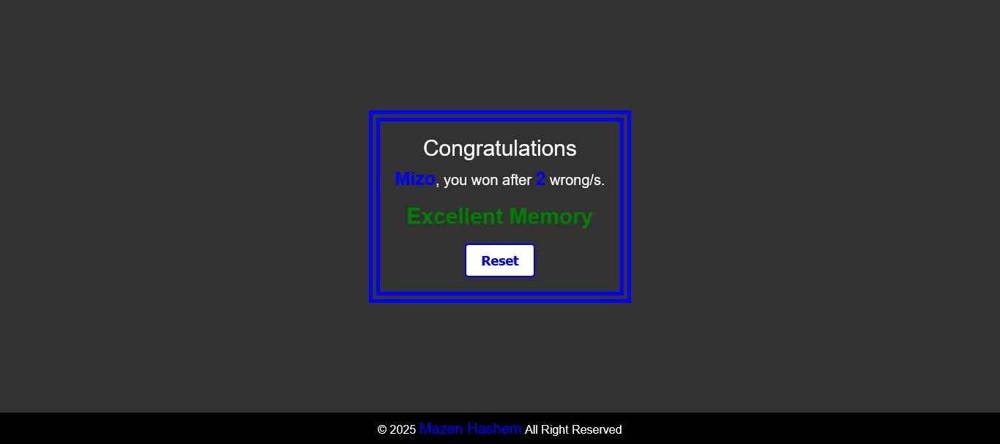

<h1>Memory Game</h1>

  

<h2>Description</h2>

  This is a Memory Game made by 
  <em>HTML</em> , 
  <em>CSS</em> and
  <em>JavaScript</em> languages.
  Inspired by 
  <strong>
    <a href="https://www.youtube.com/@ElzeroWebSchool">ElzeroWebSchool</a>
  </strong> 
  channel.

My goal from this project is to show my experience in Front-end web development.

<h3><u>Functionality:</u></h3>
<h4>On window load:-</h4>
<ul>
  <li>It will prepare game data (images) from a variable, then double it.</li>
  <li>After doubling, It will arrange randomly.</li>
</ul>
<h4>On click start:-</h4>
<ul>
  <li>To start, player must fill the input with any value.</li>
  <li>Game will create and functionality of buttons will run.</li>
  <li>Front cards will show for 2.5s.</li>
</ul>
<h4>While playing:-</h4>
<ul>
  <li>Click on two cards to compare between them, try to finish the game without mistakes, but if wrong: the wrong answer counter will increment by one.</li>
  <li>
    <h5>Result levels:</h5>
    <ul>
      <li>From 0 to 5 mistakes => Excellent.</li>
      <li>From 6 to 15 mistakes => Good.</li>
      <li>From 16 and more mistakes => Bad.</li>
    </ul>
  </li>
</ul>

<h3><u>Responsiveness:</u></h3>

  The website is responsive, it created to use across all devices, such as modern desktops, tablets, and phone browsers.

<h2>Screenshot</h2>
<h3><u>Start:</u></h3>

<h3><u>Game box:</u></h3>

<h3><u>Result:</u></h3>
<h4>Excellent:-</h4>

<h4>Good:-</h4>

<h4>Bad:-</h4>
